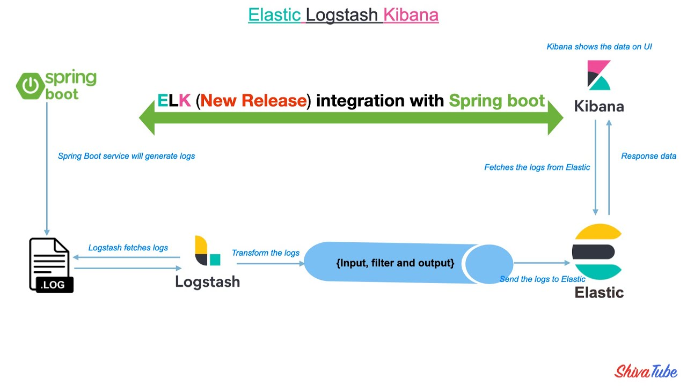
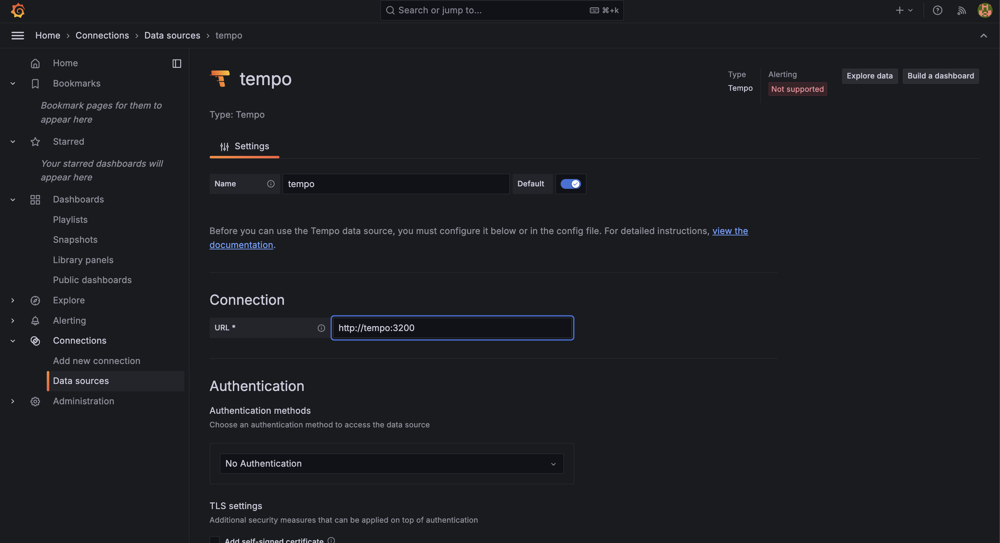
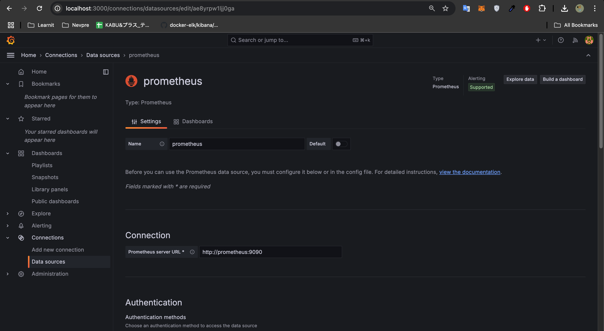
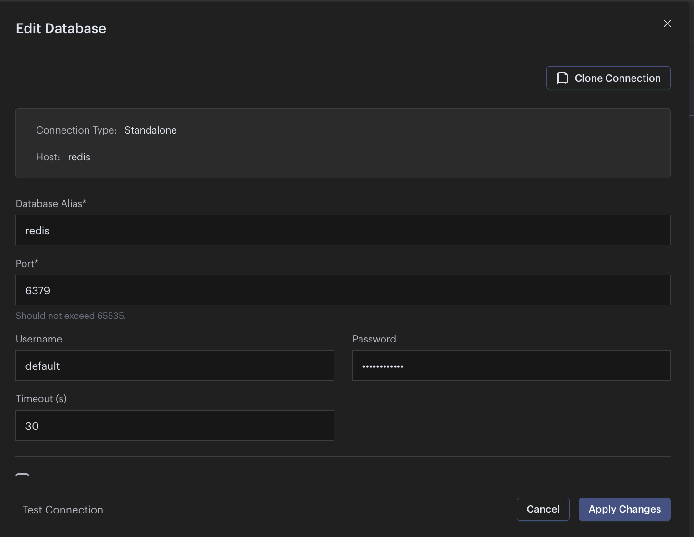
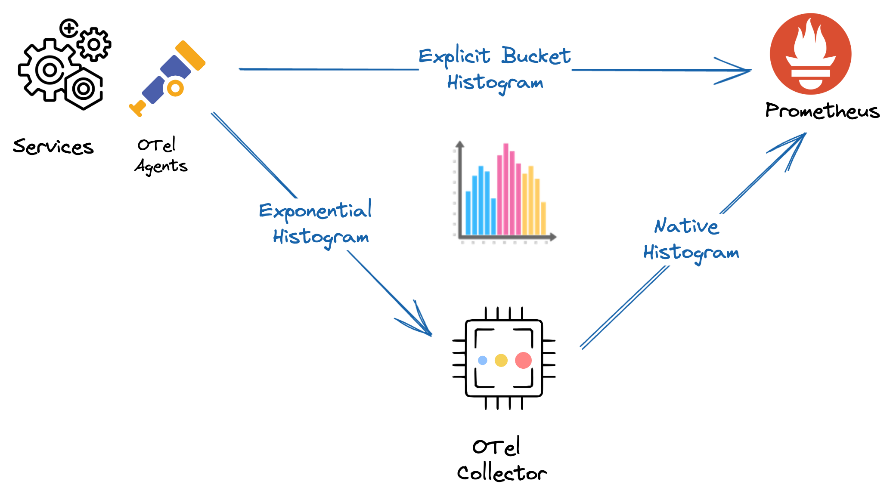
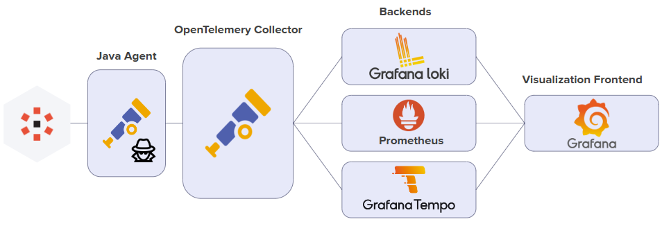

# Project Table
## Development Environment
### API

| API                                               | Description          | 
|---------------------------------------------------|----------------------|
| http://localhost:8080/userservice/swagger-ui.html | User Service Swagger | 

### Database

| Database      | Host                  | Tables                      | User | Password |
|---------------|-----------------------|-----------------------------|------|----------|
| userservicedb | http://localhost:5432 | userProfile<br/>userAccount | sa   | sa       |

### Service
| Service          | App Name        | Default Address       | Databases               | Description                                                             |
|------------------|-----------------|-----------------------|-------------------------|-------------------------------------------------------------------------|
| Auth Service     | authservice     | http://localhost:8101 | ----------------------- | Responsible for user authentication and authorization.                  |
| Config Service   | configservice   | http://localhost:8888 | ----------------------- | Provides configuration management for microservices.                    |
| Gateway Service  | gatewayservice  | http://localhost:8080 | ----------------------- | Acts as the API gateway, routing requests to appropriate microservices. |
| Registry Service | registryservice | http://localhost:8765 | ----------------------- | Manages service discovery and registration for microservices.           |
| User Service     | userservice     | http://localhost:8100 | userservicedb           | Manages user data and profile-related operations.                       |
| Email Service    | emailservice    | --------------------- | ----------------------- | -----------------------                                                 |

### Third Party UI

| Name             | Address                | Credential                                 | Description                                         |
|------------------|------------------------|--------------------------------------------|-----------------------------------------------------|
| RabbitMQ         | http://localhost:15672 | Username: sa <br/> Password: sa            | ---------                                           |
| ELK              | ---------              | ------------------                         | ELK stack for centralized logging                   |
| 1. Elasticsearch | http://localhost:9200  |                                            | - Insert data to Elastic                            |
| 2. Logstash      | http://localhost:5044  |                                            | - Handle logging and send to elastic                |
| 3. Kibana        | http://localhost:5601  | Username: elastic <br/> Password: changeme | - Visualize logging data                            |
| Grafana Tempo    | http://localhost:4318  |                                            | Backend for tracing data                            | 
| Grafana          | http://localhost:3000  | Username: admin <br/> Password: admin      | Visualize data platform                             |
| prometheus       | http://localhost:9090  |                                            | Backend for metric data                             |
| Otel-collector   | grpc://localhost:4317  |                                            | Contain data to integrate with Tempo And Prometheus |
| Redis Insight    | http://localhost:5540  | Username: default <br/> Password: sa       | Redis UI                                            |


### Queue

| Exchange       | Queue            | Routing Key    | 
|----------------|------------------|----------------|
| email_exchange | send_email_queue | send_email_key | 

### Configuration
#### ELK (Elastic-Logstash-Kibana)
1. Setup ELK first
```
docker compose up setup
```

2.[Optional: In case required credential] Visit kibana
2.1. Create-enrollment-token to visit kibana
```
docker exec -it elasticsearch /usr/share/elasticsearch/bin/elasticsearch-create-enrollment-token -s kibana
```
2.2. Login to kibana
```
UserName: Refer to service information
Password: Generated when you started Elasticsearch.
```
To regenerate the password, run:
```
docker exec -it elasticsearch bin/elasticsearch-reset-password -u elastic
```
2.3. Generate verification code
```
docker exec -it kibana bin/kibana-verification-code
```
2.4. Copy the http_ca.crt SSL certificate from the container to your local machine.
```
docker cp elasticsearch:/usr/share/elasticsearch/config/certs/http_ca.crt .
```
2. Setting up JVM
2.1. For intelliJ IDE
```
-javaagent:/Users/ligyn-004/Documents/Personal/nevpre/backend/infrastructure/otel/opentelemetry-javaagent.jar
-Dotel.exporter.otlp.endpoint=http://localhost:4317
-Dotel.exporter.otlp.protocol=grpc
-Dotel.service.name=app
-Dotel.metrics.exporter=otlp
-Dotel.traces.exporter=otlp
-Dotel.logs.exporter=none
-Dotel.javaagent.debug=true
-Dotel.instrumentation.mdc.enabled=true
```
3. Setting up Grafana Tempo in Grafana



4. Setting up Prometheus in Grafana



#### Redis


### Design
## Metric Data Observably Design

- OpenTelemetry Agent (often running within your application) uses a push model to send data to a collector. The agent generates telemetry data (e.g., metrics, traces, logs) and pushes them to the OpenTelemetry Collector or directly to a backend service.
- Prometheus uses a pull model for collecting metrics. This means Prometheus scrapes data from endpoints that expose metrics in a specific format (typically HTTP/Prometheus exposition format).\
Prometheus will periodically call the OpenTelemetry Collector's /metrics endpoint to scrape the metrics.
## Trace Data Observably Design

- The Agent pushes trace data to the OpenTelemetry Collector.
- The Collector pushes the data to Tempo, which is the backend in this case. Tempo is designed to receive trace data through a push mechanism, typically over gRPC or HTTP.

#### Circuit Breaker Config
A Circuit Breaker has three primary states: CLOSED, OPEN, and HALF-OPEN. 
These states represent the behavior of the circuit breaker in response to the success or failure of service calls. 
Below is an explanation of each state and its transitions:
1. CLOSED State
- Behavior:
  + All requests pass through to the service.
  + The circuit breaker monitors the success and failure rates of these requests using the configured sliding window.
  If the failure rate threshold (e.g., 50%) is breached, the circuit breaker transitions to the OPEN state.
- Key Metrics Monitored:
  + Failure rate.
  + Number of requests in the sliding window.
- Transition to Other States:
  + To OPEN: If the failure rate exceeds the threshold.
  + Stays CLOSED if the failure rate remains below the threshold.
2. OPEN State
- Behavior:
  + All requests are blocked, and the circuit breaker immediately returns an error or fallback response.
  This prevents additional load on the failing service, allowing it to recover.
- Configured Time:
  + The breaker remains in the OPEN state for the configured waitDurationInOpenState (e.g., 10 seconds).
- Transition to Other States:
  + To HALF-OPEN: After the waitDurationInOpenState has elapsed, the breaker transitions to HALF-OPEN and allows limited test requests.
3. HALF-OPEN State
- Behavior:
+ A limited number of requests (defined by permittedNumberOfCallsInHalfOpenState, e.g., 3) are allowed to pass through to the service as "test calls."
+ The breaker evaluates the outcomes of these test calls:
If most of them are successful, the service is considered healthy, and the breaker transitions to CLOSED.
If a failure threshold is met, the breaker transitions back to OPEN.
- Transition to Other States:
+ To CLOSED: If the test calls succeed within acceptable limits.
+ To OPEN: If the failure threshold is reached during test calls.
4. State Transitions Summary
- CLOSED → OPEN:
  + Triggered when the failure rate exceeds the configured threshold (e.g., 50%) in the sliding window.
- OPEN → HALF-OPEN:
  + Triggered after the configured waitDurationInOpenState (e.g., 10s).
- HALF-OPEN → CLOSED:
  + Triggered when the test calls in the HALF-OPEN state succeed within acceptable limits.
- HALF-OPEN → OPEN:
  + Triggered when the test calls fail beyond the acceptable threshold.

```
[CLOSED] → (Failure Rate > Threshold) → [OPEN]
[OPEN] → (Wait Duration Expires) → [HALF-OPEN]
[HALF-OPEN] → (Test Calls Successful) → [CLOSED]
[HALF-OPEN] → (Test Calls Fail) → [OPEN]
```

- registerHealthIndicator
  **Description**: Enables a health indicator for this circuit breaker, which integrates with the health monitoring system (like Spring Boot Actuator).
  **Effect**: You can monitor the circuit breaker's health status (OPEN, CLOSED, or HALF-OPEN) via Actuator's /actuator/health endpoint.
- slidingWindowSize
  **Description**: Sets the size of the sliding window used to evaluate call results.
  **Effect**: The circuit breaker considers the outcome of the last 5 calls for calculating metrics (like failure rate).
- permittedNumberOfCallsInHalfOpenState
  **Description**: Specifies the number of test calls that are allowed when the circuit breaker is in the HALF-OPEN state.
  **Effect**: In the HALF-OPEN state, the circuit breaker allows up to 3 calls to test if the issue is resolved. Based on the result, the breaker either transitions to CLOSED (if successful) or goes back to OPEN (if failures persist).
- slidingWindowType
  **Description**: Configures the sliding window type to be COUNT_BASED.
  **Effect**: The sliding window size is based on the number of calls (5 calls in this case). Alternatively, a TIME_BASED sliding window would evaluate calls over a time period.
- minimumNumberOfCalls
  **Description**: Sets the minimum number of calls required before the circuit breaker evaluates whether to transition states (e.g., OPEN).
  **Effect**: Until 5 calls are made, the circuit breaker remains in its default state (CLOSED), regardless of failures.
- waitDurationInOpenState
  **Description**: Configures how long the circuit breaker should stay in the OPEN state before transitioning to HALF-OPEN.
  **Effect**: After staying OPEN for 10 seconds, the circuit breaker will allow test calls to determine if the issue has been resolved.
- failureRateThreshold
  **Description**: Sets the threshold for the failure rate (as a percentage) that triggers the circuit breaker to transition to OPEN.
  **Effect**: If 50% or more of the calls in the sliding window fail, the circuit breaker transitions to the OPEN state.

```
The circuit breaker monitors the last 5 calls (sliding window of size 5, COUNT_BASED).
If at least 5 calls are made and 50% of them fail, the circuit breaker transitions to OPEN.
It remains OPEN for 10 seconds, then transitions to HALF-OPEN.
In the HALF-OPEN state, up to 3 test calls are permitted. If they succeed, the breaker goes back to CLOSED; otherwise, it reverts to OPEN.

```
