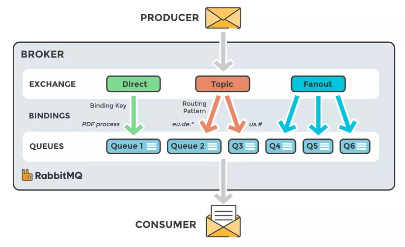

# Rabbitmq
## Queues
Queue is a storage to store ordered collection of messages and allows 
enqueue and dequeue in FIFO (first in first out) order
## Exchange types
In RabbitMQ, published messages are not directly sent to the queue, instead 
message is published to exchange then it is sent to the queue.
### Fanout
This is the default exchange type and it just broadcasts all the messages it 
receives to all the queues it knows.
### Direct
A message will go to the queues whose binding key exactly matches the routing key 
of the message
One queue can be bind with multiple routing key
### Topic
A message will go to the queues whose binding key matches the pattern of routing key
of the message
### Headers
Headers exchange routes messages based on arguments containing headers and optional values

## Notes
- Queue have to bind with exchange and routing key
- If multiple consumer listen on a queue , message will be routed to only 1 consumer by round-robin 
- If you want multiple consumers to consume the same message, you can create multiple queues (one per consumer) and bind them to the exchange.

### Acknowledgment
Message acknowledgment ensures that a message is successfully processed before it is removed from the queue
#### Automatic Acknowledgment 
With automatic acknowledgment, messages are acknowledged as soon as they are received. This is less reliable 
because if an exception occurs during message processing, the message may be lost.

